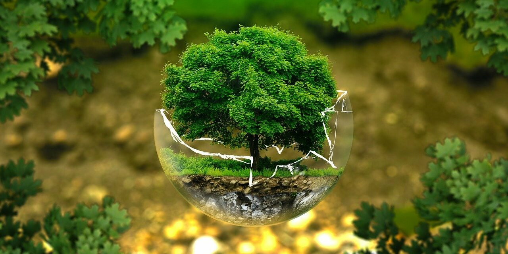

<!DOCTYPE html>

<html lang="es">

<head>
    
    <meta charset="UTF-8">

    <meta name="viewport" content="width=device-width, initial-scale=1.0">

    <title>Conciencia Ecológica y Alimentación Saludable</title>

    <link rel="stylesheet" href="estilos.css">

</head>

<body>

    <header>
        
        <h1>Conciencia Ecológica y Alimentación Saludable</h1>

        <nav>
          
            <ul>

                <li><a href="index.html">Inicio</a></li>

                <li><a href="estadisticas.html">Estadísticas</a></li>

                <li><a href="educacion.html">Educación</a></li>

                <li><a href="consejos.html">Consejos</a></li>

                <li><a href="recetas.html">Recetas</a></li>

                <li><a href="actividades.html">Actividades</a></li>

                <li><a href="testimonios.html">Testimonios</a></li>

            </ul>

        </nav>

    </header>

    <main>

        <section class="intro">

            

            <h2>Bienvenidos a nuestra Iniciativa</h2>

            
Descubre cómo puedes ayudar a reducir la basura en nuestro plantel y adoptar hábitos alimenticios saludables.

        </section>

    </main>

    <footer>

        
&copy; 2024 Plantel 20 Del Valle “Matías Romero” 
            Granados Alva Karla Valentina
            Chavero Contreras María Fernanda
        

    </footer>

</body>

</html>
